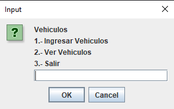
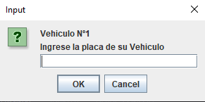
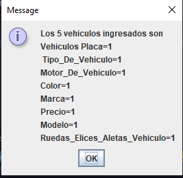

# Deber Repaso

Realizado por David Basantes.

## Estructura del proyecto

Realizado con Vscode y lo que se tiene es lo siguiente

- `src`: Contiene las clases de vehiculos y main
- `lib`: Contiene las dependencias

> Si deseas customizar la configuracion lo puedes hacer en la carpeta `.vscode/settings.json`

### Imagenes de ejecucion

